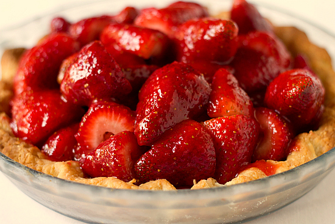

strawberry pie
========

todo
--------
* more ui elements (text box, labels, sliders)
* more ui options
* shaders  
* logging system
* error handling
* clean up how the ui works

strawberry pie uses the following libraries
--------
* GLFW3  
* Font-Stash  
* Bullet  
* tiny-obj-loader  
* SOIL  